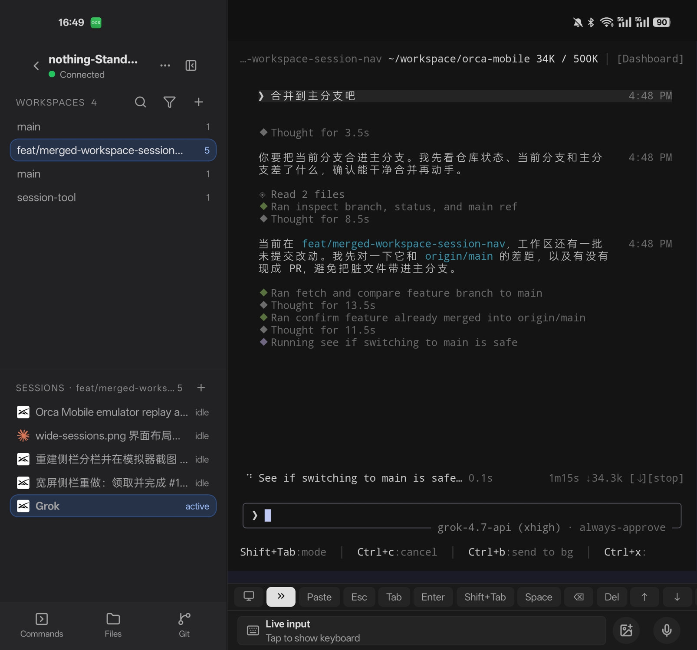

<h1 align="center">
   Orca Fold
</h1>

  
  
  
  

  <a href="../../README.md">English</a>

  <strong>非官方。</strong> 这是独立维护的 Orca 移动端折叠屏优化版。 
  不是 Lovecast Inc. 发布的作品，也不是官方 Orca 应用。

  合上时一次进入一个工作区。展开后的内屏把工作区列表、会话列表和实时终端放在同一屏。

<h3 align="center"><a href="https://github.com/Nothing1024/orca-fold-mobile/releases/latest"><ins>下载 Android APK</ins></a></h3>

  

## 这个版本改了什么

智能体仍然跑在已配对的桌面上。这个应用只是那台主机的远程屏幕，宽屏布局针对折叠屏内屏。

- **合上的手机** — 主机列表一次进入一个工作区。
- **展开的内屏** — 同一个主机把工作区、会话和实时终端放在同一屏。
- **工作区** — 按仓库分组已配对桌面上的 worktree，搜索并打开你要的那个。
- **会话** — 查看当前工作区里的终端和智能体会话，包括哪一个正在跑。
- **实时终端** — 在手机上阅读智能体记录，并输入下一条提示。
- **文件、Git 和命令** — 不离开这台主机就能打开文件、源码管理和快捷命令。

## 安装

Android 构建发布在本仓库。最新版本是 [0.0.53](https://github.com/Nothing1024/orca-fold-mobile/releases/tag/mobile-android-v0.0.53)（`arm64-v8a`）。

- **[下载最新 APK](https://github.com/Nothing1024/orca-fold-mobile/releases/latest/download/app-release.apk)**
- 与正在运行 Orca 的桌面配对。桌面负责移动连接；手机本身不运行智能体。

本地启动、配对和 mock 主机写在 [`mobile/README.md`](../../mobile/README.md)。

## 智能体

手机显示的是桌面终端里已经在跑的 CLI 智能体。Claude Code、Codex、Grok，以及那台主机上的其他终端智能体，显示方式相同。

## 反馈

折叠屏上的布局问题，或是缺了什么？[开一个 issue](https://github.com/Nothing1024/orca-fold-mobile/issues)。

## 许可证

Orca 原作版权归 Lovecast Inc.，采用 MIT 许可证。这份非官方折叠屏版本在同一份 [MIT 许可证](../../LICENSE) 下分发。
